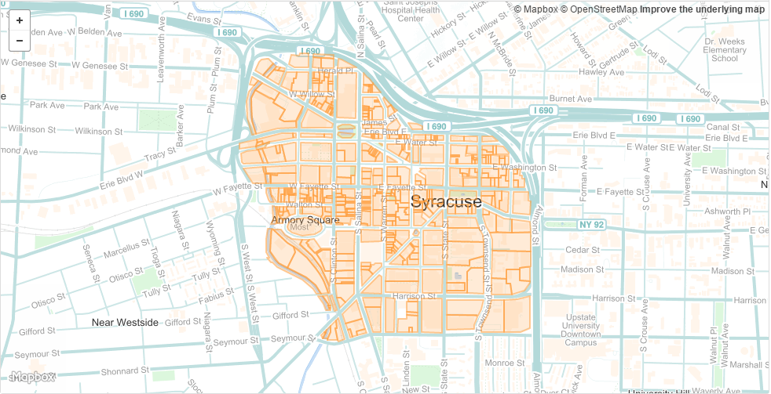

# Maps in R

This vignette contains some examples from various mapping packages in R to introduce the reader to some usefull tools and conventions.

The R Notebook of this tutorial is available as an [RPub here](http://rpubs.com/jdlecy/maps_in_r).

The demographic data for the choropleth maps is from the [DataUSA API](http://datausa.io/).

A tutorial on using the DataUSA API is available as a [GitHub Gist here](https://gist.github.com/lecy/0aa782a873cd174573f32d243233ca5b).

The code violation CSV file is available in the [data folder](./Data).

The shapefile for downtown tax parcels is available [here](./Data/Downtown_Syracuse.geojson).

